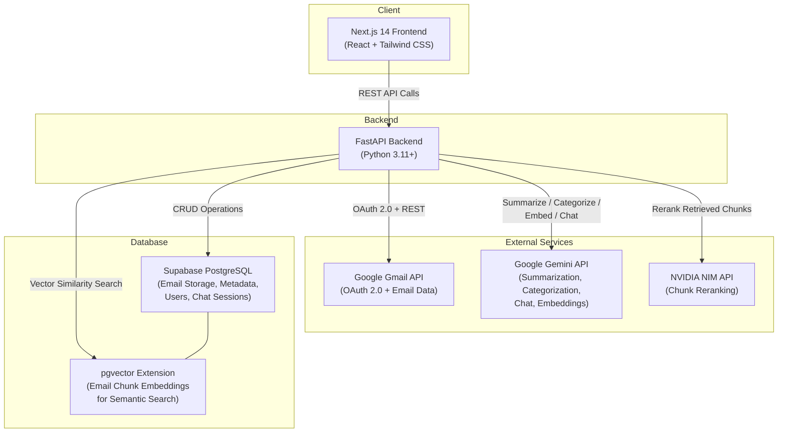
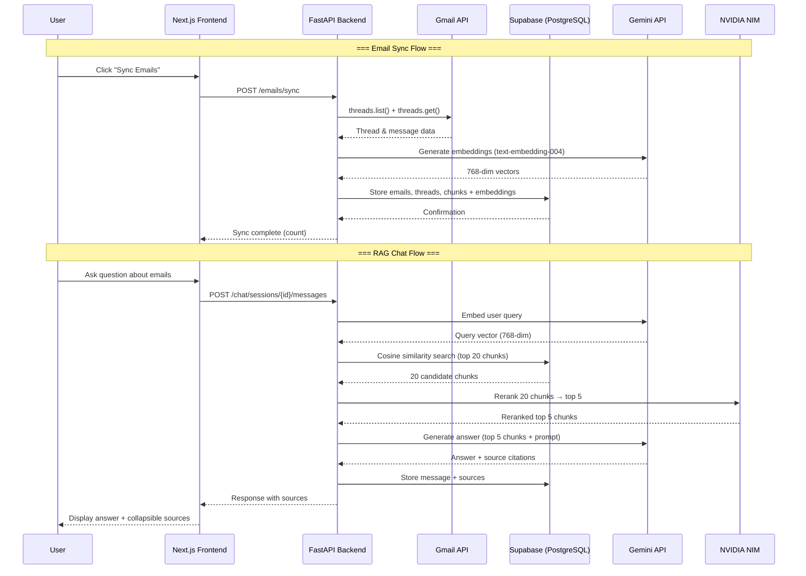
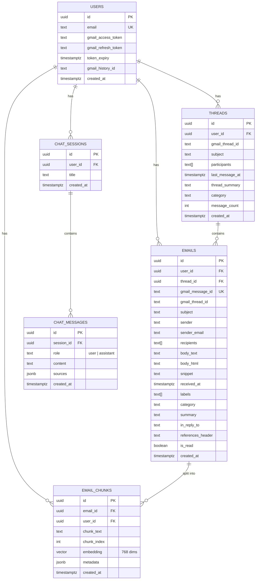
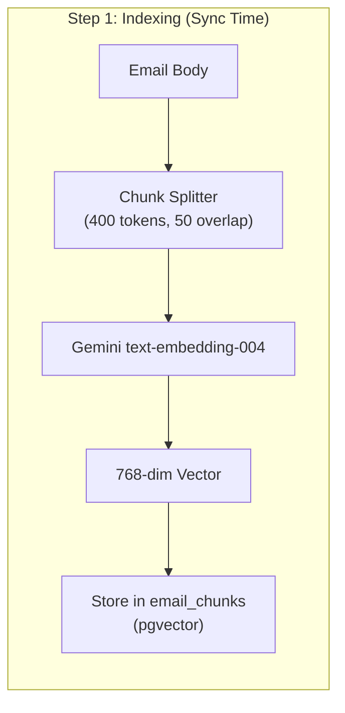
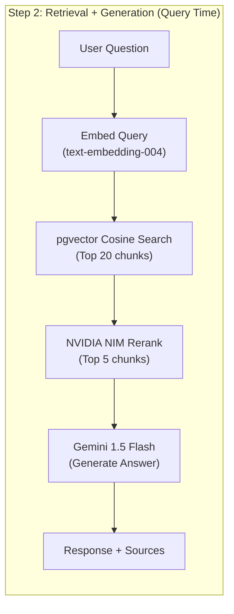
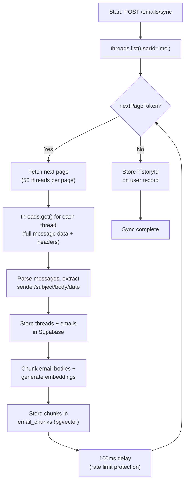

# Architecture & Design Document — Gmail Intelligence Platform

This document describes the architecture, data model, AI pipeline design, and technology decisions behind the Gmail Intelligence Platform.

---

## 1. System Architecture

The platform follows a standard **three-tier architecture** — a Next.js frontend communicates with a FastAPI backend, which orchestrates all external service integrations (Gmail API, Gemini AI, NVIDIA NIM) and database operations (Supabase PostgreSQL + pgvector).



### Data Flow Overview



### Background Flows

- **Email Sync** is triggered **manually** by the user (future improvement: webhook-based or cron-based sync)
- **Embeddings** are generated at sync time — every email body is chunked and embedded immediately upon sync
- **Categorization** can be triggered in batch after sync or individually per email
- **Summarization** is generated on-demand when a user views an email or thread

---

## 2. Database Schema

The full schema lives in [`supabase/schema.sql`](./supabase/schema.sql). Below is the complete schema with design rationale.

### Entity Relationship Diagram



### Full Schema (SQL)

```sql
-- Enable pgvector extension
CREATE EXTENSION IF NOT EXISTS vector;

-- USERS TABLE
CREATE TABLE users (
  id UUID PRIMARY KEY DEFAULT gen_random_uuid(),
  email TEXT UNIQUE NOT NULL,
  gmail_access_token TEXT,
  gmail_refresh_token TEXT,
  token_expiry TIMESTAMPTZ,
  gmail_history_id TEXT,  -- used for incremental sync
  created_at TIMESTAMPTZ DEFAULT NOW()
);

-- THREADS TABLE
CREATE TABLE threads (
  id UUID PRIMARY KEY DEFAULT gen_random_uuid(),
  user_id UUID REFERENCES users(id) ON DELETE CASCADE,
  gmail_thread_id TEXT NOT NULL,
  subject TEXT,
  participants TEXT[],
  last_message_at TIMESTAMPTZ,
  thread_summary TEXT,
  category TEXT,
  message_count INT DEFAULT 0,
  created_at TIMESTAMPTZ DEFAULT NOW(),
  UNIQUE(user_id, gmail_thread_id)
);

-- EMAILS TABLE
CREATE TABLE emails (
  id UUID PRIMARY KEY DEFAULT gen_random_uuid(),
  user_id UUID REFERENCES users(id) ON DELETE CASCADE,
  thread_id UUID REFERENCES threads(id) ON DELETE CASCADE,
  gmail_message_id TEXT UNIQUE NOT NULL,
  gmail_thread_id TEXT NOT NULL,
  subject TEXT,
  sender TEXT,
  sender_email TEXT,
  recipients TEXT[],
  body_text TEXT,
  body_html TEXT,
  snippet TEXT,
  received_at TIMESTAMPTZ,
  labels TEXT[],
  category TEXT,
  summary TEXT,
  in_reply_to TEXT,
  references_header TEXT,
  is_read BOOLEAN DEFAULT FALSE,
  created_at TIMESTAMPTZ DEFAULT NOW()
);

-- EMAIL CHUNKS TABLE (for RAG / pgvector)
CREATE TABLE email_chunks (
  id UUID PRIMARY KEY DEFAULT gen_random_uuid(),
  email_id UUID REFERENCES emails(id) ON DELETE CASCADE,
  user_id UUID REFERENCES users(id) ON DELETE CASCADE,
  chunk_text TEXT NOT NULL,
  chunk_index INT NOT NULL,
  embedding vector(768),  -- Gemini text-embedding-004 outputs 768 dims
  metadata JSONB,         -- stores: sender, sender_email, subject, date, thread_id, gmail_message_id
  created_at TIMESTAMPTZ DEFAULT NOW()
);

-- CHAT SESSIONS TABLE
CREATE TABLE chat_sessions (
  id UUID PRIMARY KEY DEFAULT gen_random_uuid(),
  user_id UUID REFERENCES users(id) ON DELETE CASCADE,
  title TEXT DEFAULT 'New Chat',
  created_at TIMESTAMPTZ DEFAULT NOW()
);

-- CHAT MESSAGES TABLE
CREATE TABLE chat_messages (
  id UUID PRIMARY KEY DEFAULT gen_random_uuid(),
  session_id UUID REFERENCES chat_sessions(id) ON DELETE CASCADE,
  role TEXT NOT NULL CHECK (role IN ('user', 'assistant')),
  content TEXT NOT NULL,
  sources JSONB,  -- list of {sender, subject, date, gmail_message_id}
  created_at TIMESTAMPTZ DEFAULT NOW()
);

-- INDEXES for performance
CREATE INDEX ON threads(user_id);
CREATE INDEX ON threads(category);
CREATE INDEX ON emails(user_id);
CREATE INDEX ON emails(thread_id);
CREATE INDEX ON emails(category);
CREATE INDEX ON emails(received_at DESC);
CREATE INDEX ON email_chunks(user_id);
CREATE INDEX ON email_chunks(email_id);
CREATE INDEX ON chat_messages(session_id);

-- pgvector index for fast similarity search
CREATE INDEX ON email_chunks
USING ivfflat (embedding vector_cosine_ops)
WITH (lists = 100);

-- FUNCTION for vector similarity search
CREATE OR REPLACE FUNCTION search_email_chunks(
  query_embedding vector(768),
  target_user_id UUID,
  match_count INT DEFAULT 20
)
RETURNS TABLE (
  id UUID,
  email_id UUID,
  chunk_text TEXT,
  chunk_index INT,
  metadata JSONB,
  similarity FLOAT
)
LANGUAGE SQL STABLE
AS $$
  SELECT
    ec.id,
    ec.email_id,
    ec.chunk_text,
    ec.chunk_index,
    ec.metadata,
    1 - (ec.embedding <=> query_embedding) AS similarity
  FROM email_chunks ec
  WHERE ec.user_id = target_user_id
  ORDER BY ec.embedding <=> query_embedding
  LIMIT match_count;
$$;
```

### Schema Design Rationale

| Decision | Rationale |
|---|---|
| **pgvector extension** | Emails are unstructured text — keyword search is insufficient for questions like "what did John say about the project deadline?" Semantic (vector) search enables natural-language retrieval over the entire inbox. |
| **`email_chunks` table** | Long emails cannot be embedded as a single vector without quality loss. Splitting into ~400-token chunks with overlap ensures each embedding captures a focused semantic unit. Chunk metadata (sender, subject, date, message_id) enables source attribution in RAG responses. |
| **`threads` table** | Thread-level operations (thread summary, thread view, conversation context) are first-class features. Storing thread metadata separately avoids expensive JOINs and aggregations at query time. |
| **JSONB for `metadata` / `sources`** | Citation data has a flexible shape (varying fields per chunk/source). JSONB allows schema-free storage while still supporting indexed queries. Avoids rigid column definitions for evolving metadata needs. |
| **`gmail_history_id` on users** | Enables incremental sync — after the initial full sync, only changes since this history ID are fetched, saving quota and time. |
| **IVFFlat index** | The `ivfflat` index with 100 lists provides a good trade-off between search speed and recall for inboxes up to tens of thousands of emails. |
| **`search_email_chunks` function** | Encapsulates the vector search query as a Supabase RPC function, keeping the similarity search logic in the database layer and simplifying backend code. |

---

## 3. AI Design

### Email Summarization

#### Individual Email Summaries

A single Gemini API call with a structured prompt:

```
Input: subject + sender + body_text
Prompt: "Summarize this email concisely in 2-3 sentences. Focus on the key action items,
         requests, or information. Include who sent it and what they want."
Model:  Gemini 1.5 Flash
```

#### Thread Summaries

All messages in the thread are passed together so Gemini understands the full conversation arc:

```
Input: All messages in chronological order (sender + body per message)
Prompt: "Summarize this email conversation. Identify the main topic, key decisions made,
         action items, and current status. Note who said what when relevant."
Model:  Gemini 1.5 Flash
```

#### Handling Long Threads

- Individual message bodies are **truncated to 2,000 characters each** to stay within context limits
- A maximum of **10 messages** are included per thread summary call
- For threads longer than 10 messages, the most recent 10 are used (most relevant context)

---

### RAG Pipeline (Chat Agent)

The RAG pipeline has two phases: **indexing** (at sync time) and **retrieval + generation** (at query time).





#### Step 1 — Indexing (at sync time)

1. Each email's `body_text` is split into **~400-token chunks** with **50-token overlap**
   - Overlap ensures no information is lost at chunk boundaries
   - Token counting uses `tiktoken` for accurate splits
2. Each chunk is embedded using **Gemini text-embedding-004** (produces 768-dimensional vectors)
3. Chunks are stored in the `email_chunks` table with metadata:
   ```json
   {
     "sender": "John Doe",
     "sender_email": "john@example.com",
     "subject": "Q3 Budget Review",
     "date": "2024-03-15T10:30:00Z",
     "thread_id": "thread_abc123",
     "gmail_message_id": "msg_xyz789"
   }
   ```

#### Step 2 — Retrieval (at query time)

1. The user's question is embedded using the **same model** (text-embedding-004)
2. **Top 20 chunks** are retrieved via cosine similarity using pgvector's `search_email_chunks` function
3. **NVIDIA NIM reranks** the 20 candidates down to the **top 5** most relevant chunks
4. The **top 5 chunks** + their metadata are sent to **Gemini 1.5 Flash** with a strict system prompt:
   ```
   You are an email assistant. Answer the user's question using ONLY the email
   excerpts provided below. Do NOT use any external knowledge. If the answer
   cannot be found in the provided emails, say: "I couldn't find information
   about that in your emails."

   For every claim you make, cite the source email using [Source: sender, subject, date].
   ```

---

### Source Attribution

Source attribution is a core design principle — every chat response must be traceable back to specific emails.

| Step | Mechanism |
|---|---|
| **Storage** | Each chunk carries metadata: `sender`, `subject`, `date`, `gmail_message_id` |
| **Prompting** | Gemini is instructed to cite sources for every claim using `[Source: ...]` notation |
| **Structured output** | Sources are returned as structured JSON alongside the answer text |
| **Display** | Sources are displayed in a collapsible UI component below each chat response |

Example response structure:
```json
{
  "answer": "The Q3 budget was approved at $50,000, as discussed between John and Sarah.",
  "sources": [
    {
      "sender": "John Doe",
      "subject": "Q3 Budget Review",
      "date": "2024-03-15",
      "gmail_message_id": "msg_xyz789"
    },
    {
      "sender": "Sarah Smith",
      "subject": "Re: Q3 Budget Review",
      "date": "2024-03-16",
      "gmail_message_id": "msg_abc456"
    }
  ]
}
```

---

### NVIDIA NIM Model Choice

| Aspect | Detail |
|---|---|
| **Model** | `nvidia/llama-3.1-nemotron-nano-8b-instruct` |
| **Role** | Reranking retrieved chunks before sending to Gemini for answer generation |
| **Why reranking?** | Gemini embedding retrieval (cosine similarity) returns topically adjacent chunks, but not all are directly relevant to the question. NIM reranking uses cross-attention to score query-chunk relevance more precisely. |
| **Why this model?** | Free tier available, strong instruction following, fast inference, and good reranking performance for its size |
| **Integration** | Called via NVIDIA NIM API (`https://integrate.api.nvidia.com/v1`) after pgvector retrieval, before Gemini generation |

---

### Hallucination Prevention

Hallucination prevention is enforced at multiple levels:

1. **System Prompt Constraints** — The system prompt explicitly forbids answering outside the provided email excerpts. No internet access or general knowledge is allowed in the chat context.

2. **Fallback Phrase** — If the answer cannot be found, the model must respond with a pre-defined exact phrase:
   > *"I couldn't find information about that in your emails."*

3. **Mandatory Source Citations** — The model must cite sources for every factual claim, forcing it to ground all statements in retrieved text.

4. **Context Limiting** — Only the top 5 reranked chunks are provided as context. This reduces the chance of the model "hallucinating connections" between unrelated emails.

5. **No Conversation Memory Bleed** — Each query retrieves fresh context from the vector store. Previous chat messages provide conversation continuity, but the model cannot carry forward facts from prior turns without re-retrieving them.

---

## 4. Gmail API Strategy

### Initial Sync



| Parameter | Value |
|---|---|
| **Batch size** | 50 threads per `threads.list()` call |
| **Delay between batches** | 100ms — prevents quota exhaustion proactively |
| **Data fetched per thread** | `threads.get(format='full')` — returns all messages with headers and body |
| **historyId** | Stored after initial sync completes; enables incremental sync |

### Incremental Sync

After the initial sync, subsequent syncs use the Gmail History API:

1. Call `history.list(startHistoryId=stored_id)` — returns only changes since last sync
2. Process only new/modified messages — fast and quota-efficient
3. Update `historyId` on the user record after each sync
4. If `historyId` is invalid (too old), fall back to full sync

> [!TIP]
> Incremental sync is dramatically faster than full sync. For an inbox with 1,000+ emails, initial sync may take several minutes, but incremental syncs typically complete in under 5 seconds.

### Pagination Strategy

- Loop while `nextPageToken` is present in the Gmail API response
- No hard limit on the number of pages — all threads are synced
- Tested to handle **1,000+ email inboxes** without breaking
- Each page processes up to 50 threads before requesting the next

### Rate Limiting

All Gmail API calls are wrapped in an exponential backoff handler:

| Retry | Wait Time |
|---|---|
| 1st retry | 1 second |
| 2nd retry | 2 seconds |
| 3rd retry | 4 seconds |
| 4th retry | 8 seconds |
| 5th retry | 16 seconds |
| After 5th | Fail and log error |

- On `429 Too Many Requests` or `5xx Server Error`: backoff and retry
- Batch delays (100ms between pages) prevent hitting rate limits proactively
- Gmail API quota: 250 quota units per user per second (sufficient for this use case)

---

## 5. Tool & Technology Decisions

| Choice | Reason |
|---|---|
| **Next.js 14** | App Router simplifies routing and layouts; React Server Components improve performance; excellent developer experience; easy deployment to Vercel |
| **Tailwind CSS** | Utility-first approach enables rapid UI development with consistent design tokens; no context switching between CSS files and components |
| **TypeScript** | Static typing catches bugs at compile time; improved IDE support and autocompletion; self-documenting code |
| **FastAPI** | Async Python is ideal for I/O-heavy AI and API integrations; auto-generated OpenAPI docs (`/docs`); Pydantic validation built in; fast to develop |
| **Supabase** | Managed PostgreSQL with pgvector support in one platform; generous free tier; REST API and client SDKs; built-in auth (though we use Google OAuth directly) |
| **pgvector** | Native vector similarity search within the existing PostgreSQL database; no need for a separate vector database (Pinecone, Weaviate); reduces infrastructure complexity and cost |
| **Gemini 1.5 Flash** | Fast inference, cost-effective, 1M token context window; free tier with generous limits; strong performance on summarization and instruction following |
| **text-embedding-004** | Same Google ecosystem as Gemini (single API key); 768-dimensional vectors offer good balance of quality and storage; strong retrieval performance on benchmarks |
| **NVIDIA NIM** | Free tier provides meaningful reranking capability; measurably improves RAG retrieval precision (reduces irrelevant chunks in top-k); simple REST API integration |
| **tiktoken** | Accurate token counting for chunk splitting; same tokenizer used by many LLMs; fast BPE implementation in Rust |

---

## 6. Trade-offs & Limitations

### What Was Simplified

| Simplification | Impact |
|---|---|
| **No background job queue** (Celery/Redis) | Email sync runs synchronously in the request handler. For large inboxes (1,000+ emails), the initial sync request may take several minutes to complete. |
| **Single user session** | No multi-user auth system. The platform assumes a single user operating locally. No session tokens, no user switching. |
| **No real-time push** | No Gmail webhook or Pub/Sub integration. New emails are only picked up when the user manually triggers a sync. |
| **Newsletter deduplication not fully implemented** | Similar newsletters (e.g., daily digests from the same sender) may create redundant chunks in the vector store, slightly degrading RAG retrieval quality. |
| **No email attachment handling** | Attachments (PDFs, images, documents) are ignored during sync. Only email body text is processed and indexed. |
| **No email search filters** | No date range, sender, or keyword search — only semantic (vector) search via the chat agent. |

### What Would Be Done Differently With More Time

| Improvement | Description |
|---|---|
| **Celery + Redis** | Background job queue for email sync. Sync would be triggered via API but processed asynchronously, with progress updates via WebSocket. |
| **Gmail Push Notifications** | Implement Google Cloud Pub/Sub webhook to receive real-time notifications when new emails arrive — eliminates need for manual sync. |
| **Multi-User Support** | Proper session management with JWT tokens, user isolation at the database level (RLS policies), and concurrent user handling. |
| **Newsletter Deduplication** | Use cosine similarity between email embeddings to detect near-duplicate newsletters and skip redundant indexing. |
| **Attachment Parsing** | Extract text from PDF, DOCX, and image attachments (via OCR) and include in the RAG index for comprehensive email search. |
| **Advanced Search** | Add traditional search filters (date range, sender, keyword) alongside semantic search for more precise queries. |
| **Streaming Responses** | Stream chat responses token-by-token using Server-Sent Events (SSE) for better perceived latency. |
| **Caching Layer** | Cache frequently asked questions and their responses to reduce API calls and improve response time. |
| **Testing** | Add unit tests for services, integration tests for API endpoints, and end-to-end tests for critical user flows. |
